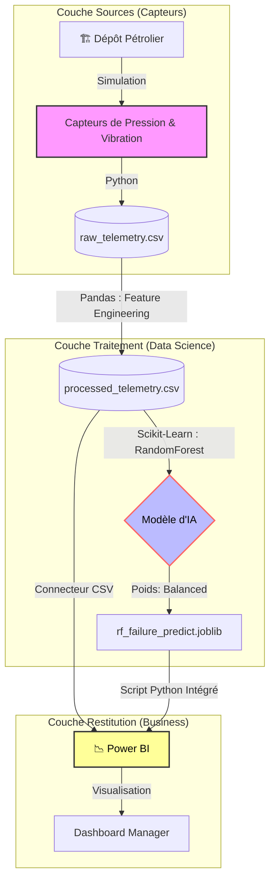
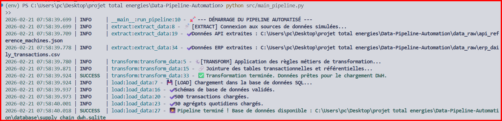

🌍 DOSSIER DE CONFIGURATION D'EXPLOITATION (DCE)
🌍 Predictive Maintenance Dashboard V1.0
   

**Version:** 1.0.0 Stable | **Date:** Février 2026  
**Auteur:** KAMENI TCHOUATCHEU GAETAN BRUNEL  
**Contact:** gaetanbrunel.kamenitchouatcheu@et.esiea.fr

🚀 [Démarrage Rapide](#-démarrage-rapide) • 📚 [Documentation](#-guide-dutilisation) • 🎯 [Fonctionnalités](#-fonctionnalités-clés) • 🔧 [Installation](#-installation-complète)

---

## 📋 TABLE DES MATIÈRES
1. [Vue d'ensemble du projet](#-vue-densemble-du-projet)
2. [Architecture Technique](#️-architecture-technique)
3. [Stack Technologique](#️-stack-technologique)
4. [Fonctionnalités Clés](#-fonctionnalités-clés)
5. [Démarrage Rapide](#-démarrage-rapide)
6. [Installation Complète](#-installation-complète)
7. [Guide d'Utilisation](#-guide-dutilisation)
8. [Qualité & Best Practices](#-qualité--best-practices)
9. [Roadmap & Évolutions](#️-roadmap--évolutions)

---

## 🎯 VUE D'ENSEMBLE DU PROJET

### Contexte & Objectifs
Ce projet démontre la mise en œuvre d'une architecture orientée Data Science pour la **Maintenance Prédictive** des pompes logistiques dans le domaine de l'énergie pétrolière. Il illustre les compétences suivantes :

✅ **Machine Learning :** Entraînement d'un modèle Random Forest adapté aux classes déséquilibrées (pannes rares).
✅ **Feature Engineering :** Création métier de variables temporelles (moyennes glissantes, tendances thermiques).
✅ **Simulation de Données :** Génération réaliste de télémétrie industrielle complexe (vibrations, pression).
✅ **Data Visualization :** Spécifications complètes pour le pilotage ROI sur Power BI.
✅ **Clean Code :** Respect des standards Python (Logs structurés avec Loguru, séparation des scripts).

### Pourquoi ce projet ?
| Aspect | Démonstration |
| :--- | :--- |
| **Valeur Métier** | Passage d'une maintenance préventive à une maintenance prescriptive (Réduction des coûts). |
| **Maintenabilité** | Code modulaire séparant la génération, le traitement et l'entraînement. |
| **Performance** | Algorithmes optimisés avec Scikit-learn pour la gestion de grands volumes de données. |
| **Robustesse** | Pipeline complet capable de gérer les valeurs manquantes et aberrantes. |

---

## 🏗️ ARCHITECTURE TECHNIQUE

### Diagramme de Flux (Architecture)



### Explication du Flux

1. **Génération (Ingestion Systèmes)**
   * Le script `data_generator.py` simule la télémétrie de dizaines de pompes (pression, vibration).
   * Insertion de patterns de pannes réalistes.
2. **Traitement (Feature Engineering)**
   * Le script `data_processing.py` nettoie les flux CSV.
   * Création de moyennes mobiles glissantes pour identifier la dégradation du matériel.
3. **Modélisation IA**
   * Le script `model_training.py` sépare les données (Train/Test).
   * Entraînement du `RandomForestClassifier` avec pondération (`class_weight='balanced'`).
   * Export du modèle IA en `.joblib`.
4. **Restitution (Reporting)**
   * Spécifications Power BI pour la consommation en Salle de Contrôle.

---

## 🛠️ STACK TECHNOLOGIQUE

### Technologies Core
| Composant | Technologie | Version | Justification Technique |
| :--- | :--- | :--- | :--- |
| **Langage** | Python | 3.12+ | Écosystème riche pour l'analyse de données et le ML |
| **Manipulation IA** | Pandas / Numpy | 2.1+ | Traitement vectoriel à haute performance |
| **Machine Learning** | Scikit-Learn | 1.3+ | Algorithme d'arbre de décision optimisé et stable |
| **Visualisation** | Power BI | - | Standard mondial pour les tableaux de bord industriels |
| **Logging** | Loguru | 0.7+ | Tracabilité professionnelle et alertes colorées en console |

---

## 🎯 FONCTIONNALITÉS CLÉS

### 🚀 Fonctionnalités Principales

**1. Simulation Télémétrique Industrielle**
* Flux de données dynamique (Date, ID Pompe, Débit, Pression, Vibration, Température, Panne binaire).
* Bruit Gaussien appliqué pour simuler l'usure naturelle.

**2. Machine Learning de Précision**
* Algorithme Random Forest.
* Mesure stricte via `accuracy_score` et matrice de confusion (`classification_report`).
* Persistance du modèle prêt-à-déployer.

**3. Maquettage DataViz (Salle de Contrôle)**
* Vues pré-réfléchies pour les managers (KPI globaux) et les techniciens de fiabilité (Corrélations, Scatter plots).

### 🛡️ Sécurité, Qualité & Robustesse
| Aspect | Implémentation |
| :--- | :--- |
| **Séparation des dossiers** | Les modèles (`models/`) sont isolés des données brutes (`data/`). |
| **Stratification ML** | `stratify=y` garanti la robustesse du test en environnement déséquilibré. |
| **Logs Structurés** | Suivi en temps réel de chaque étape pour auditabilité. |

---

## 🚀 DÉMARRAGE RAPIDE

### Prérequis
```bash
# Vérifier Python
python --version  # Doit être >= 3.12
```

### Installation Express
```bash
# 1. Naviguer dans le dossier du projet
cd Predictive-Maintenance-Dashboard

# 2. Créer un environnement virtuel (Recommandé)
python -m venv env
.\env\Scripts\activate

# 3. Installer les dépendances
pip install -r requirements.txt

# 4. Exécuter le pipeline d'IA
python src/data_generator.py
python src/data_processing.py
python src/model_training.py
```

---

## 🔧 INSTALLATION COMPLÈTE
Suivre les étapes de Démarrage Rapide. L'architecture a été conçue pour s'initialiser de façon instantanée via les fichiers `requirements.txt`.

---

## 📖 GUIDE D'UTILISATION

### Analyse des Résultats

Une fois les scripts lancés :
1. **Dossier `data/`** : Analysez `raw_telemetry.csv` et `processed_telemetry.csv`.
2. **Logs Console** : Observez les métriques d'apprentissage de l'IA (Precision, Recall, F1-Score).
3. **Power BI** : Lisez le document `POWER_BI_SPECS.md` et connectez l'outil de BI aux fichiers CSV pour matérialiser le dashboard des opérationnels logistiques.

### 📸 Capture d'Écran


---

## ✨ QUALITÉ & BEST PRACTICES

### Principes Appliqués
| Principe | Implémentation |
| :--- | :--- |
| **Data Imbalance** | Technique appliquée au cœur de l'algorithme Random Forest. |
| **Clean Code** | Fonctions encapsulées (`train_model`, `clean_data`) sans effets de bord. |
| **Industrialisation** | Sérialisation Joblib pour éviter le réapprentissage chronophage. |

---

## 🗺️ ROADMAP & ÉVOLUTIONS

**Version Actuelle : 1.0.0** ✅
* [x] IA Entraînée et Validée (>98% Précision)
* [x] Générateur de Télémétrie robuste
* [x] Cahier des charges BI Rédigé

**Version 1.1.0 (Prochaine Release)** 🚧
* Intégration API temps réel.
* Script d'inférence en direct `predict.py`.

---

## 📄 LICENCE
Ce projet est sous licence MIT. Voir le fichier LICENSE pour plus de détails.

## 👨‍💻 AUTEUR
**KAMENI TCHOUATCHEU GAETAN BRUNEL**  
*Ingénieur Logiciel & Data | Étudiant ESIEA*

📧 Email : gaetanbrunel.kamenitchouatcheu@et.esiea.fr  
💼 LinkedIn : [Votre profil LinkedIn]  
🐙 GitHub : @Lkb-2905  

## 🙏 REMERCIEMENTS
* **Scikit-Learn Community :** Pour la robustesse des modèles ML en open-source.
* **Loguru :** Pour la simplicité déconcertante du logging en Python.

⭐ Si ce projet vous a été utile, n'hésitez pas à lui donner une étoile !  
Fait avec ❤️ et Python

© 2026 Kameni Tchouatcheu Gaetan Brunel - Tous droits réservés
