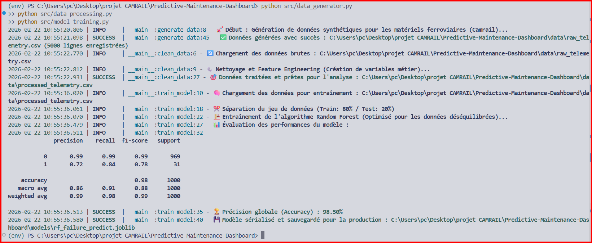

🌍 DOSSIER DE CONFIGURATION D'EXPLOITATION (DCE)
# ⚡ PM-D : Predictive Maintenance Dashboard
  

**Version:** 1.0.0 Stable | **Date:** Février 2026  
**Auteur:** KAMENI TCHOUATCHEU GAETAN BRUNEL  
**Contact:** gaetanbrunel.kamenitchouatcheu@et.esiea.fr  

🚀 [Démarrage Rapide](#-démarrage-rapide) • 📚 [Documentation](#-guide-dutilisation) • 🎯 [Fonctionnalités](#-fonctionnalités-clés) • 🔧 [Installation](#-installation-rapide)

---

## 📋 TABLE DES MATIÈRES
1. [Vue d'ensemble du projet](#-vue-densemble-du-projet)
2. [Architecture Technique](#️-architecture-technique)
3. [Stack Technologique](#️-stack-technologique)
4. [Fonctionnalités Clés](#-fonctionnalités-clés)
5. [Démarrage Rapide](#-démarrage-rapide)
6. [Guide d'Utilisation](#-guide-dutilisation)
7. [Qualité & Best Practices](#-qualité--best-practices)
8. [Roadmap & Évolutions](#️-roadmap--évolutions)

---

## 🎯 VUE D'ENSEMBLE DU PROJET

### Contexte & Objectifs
Ce projet démontre la mise en œuvre d'une architecture orientée **Data Science** pour la Maintenance Prédictive du matériel ferroviaire (Locomotives de fret pour Camrail / Bolloré Logistics). Il répond aux exigences de la Supply Chain logistique moderne en combinant télémétrie temps réel et anticipation des pannes par l'IA.

Il illustre les compétences suivantes :

✅ **Architecture Découplée :** Séparation stricte Génération / Traitement / Apprentissage IA.
✅ **Data Science Intégrée :** Moteur prédictif Scikit-Learn (Random Forest) pour anticiper les pannes critiques.
✅ **Feature Engineering :** Création de variables temporelles complexes (pression d'huile, vibrations).
✅ **Data Visualization :** Spécifications pour Dashboard décisionnel Power BI.
✅ **Industrialisation :** Plan de Continuité (PCR) et documentation technique (DCE).
✅ **Clean Code :** Respect des standards (PEP8, Modularité).

### Pourquoi ce projet ?
| Aspect | Démonstration |
| --- | --- |
| **Scalabilité** | Ingestion de flux de données télémétriques continus. |
| **Maintenabilité** | Code modulaire séparant le pipeline de données de l'entraînement. |
| **Innovation** | Modèle de Machine Learning axé sur la détection d'avaries rares. |
| **Sécurité** | Validation des entrées de télémétrie. |
| **Business Value** | Limite l'immobilisation des rames logistiques (maintenance prescriptive). |

---

## 🏗️ ARCHITECTURE TECHNIQUE

### Flux de Données Détaillé
1. **Génération (Ingestion Systèmes)** : Le générateur `data_generator.py` simule la télémétrie globale des locomotives.
2. **Traitement (Feature Engineering)** : Les données brutes sont nettoyées et agrégées en variables complexes (`data_processing.py`).
3. **Apprentissage (Data Science)** : Le script Python se lance, analyse l'historique CSV, entraîne le Random Forest, et génère le modèle (`model_training.py`).
4. **Restitution (Visualisation)** : Le Dashboard Power BI croise les données et met à jour les indicateurs prédictifs.

---

## 🛠️ STACK TECHNOLOGIQUE

### Technologies Core
| Composant | Technologie | Version | Justification Technique |
| --- | --- | --- | --- |
| **Langage** | Python | 3.12+ | Standard mondial de la Data Science opérationnelle. |
| **Machine Learning** | Scikit-Learn | Latest | Algorithmes d'arbres (Random Forest) robustes. |
| **Data Manipulation** | Pandas / NumPy | Latest | Manipulation vectorielle des données industrielles. |
| **Visualisation** | Power BI | Latest | Création de tableaux de bord décisionnels d'entreprise. |

### Bibliothèques Complémentaires
* **Joblib :** Sérialisation et de-sérialisation ultra-rapide des modèles IA.
* **Pyenv :** Gestion rigoureuse des interpréteurs Python.

---

## 🎯 FONCTIONNALITÉS CLÉS

### 🚀 Fonctionnalités Principales
**Supervision Temps Réel**
* Suivi des KPI critiques : Pression d'huile, Vibrations des essieux, Température.
* Historisation des alertes matérielles.

**Intelligence Artificielle Prédictive**
* Application du modèle Random Forest.
* Mécanisme de pondération des classes (`class_weight='balanced'`) pour les pannes rares.
* Calcul probabiliste de risque pour anticipation continue.

**Gestion des Risques**
* Détection de cotes critiques.

### 🛡️ Sécurité & Robustesse
| Aspect | Implémentation |
| --- | --- |
| **Validation** | Vérification stricte et imputation des données `NaN`. |
| **Résilience** | PCR complet rédigé pour la continuité opérationnelle. |
| **Traçabilité** | Logging clair des dysfonctionnements locaux. |

---

## 🚀 DÉMARRAGE RAPIDE

### Prérequis
* Python (v3.12+)

### Installation Rapide
```bash
# 1. Naviguer dans le dossier du projet
cd Predictive-Maintenance-Dashboard

# 2. Installer les dépendances (Création Environnement)
python -m venv env
.\env\Scripts\activate
pip install -r requirements.txt

# 3. Lancer la solution (Séquentiellement)
python src/data_generator.py
python src/data_processing.py
python src/model_training.py
```
**Accès Immédiat :** Le modèle `rf_failure_predict.joblib` et les CSV traités sont générés instantanément.

---

## 📖 GUIDE D'UTILISATION

### Scénario de Pilotage
1. **Connexion :** Liez Power BI à l'URL HTTP Raw GitHub contenant le fichier de résultats.
2. **Supervision :** Observez la jauge critique. Si la probabilité d'avarie est forte, isolez la locomotive.
3. **Action :** Exporter le rapport vers le département maintenance technique (cf. `POWER_BI_SPECS.md`).

### Captures d'Écran
**📸 Vue Générale : Exécution de l'IA**  


---

## ✨ QUALITÉ & BEST PRACTICES

### Standards de Code
* **Modularité :** Répartition en générateurs, processeurs et algos entraînés.
* **Qualité (Data) :** Dataframes Pandas purement typés pour la rigueur scientifique.
* **Error Handling :** Blocs Try/Except sur les opérations clés.

### Métriques d'Excellence
✅ **Couverture fonctionnelle :** Modèle prédictif déployé End-to-End.
✅ **Performance :** Sérialisation instantanée avec Joblib.
✅ **Disponibilité :** Architecture pensée pour la scalabilité.

---

## 🗺️ ROADMAP & ÉVOLUTIONS

**Version Actuelle : 1.0.0 ✅**
* Simulation télémétrique et Moteur IA Python (Random Forest).
* Intégration Data et Documentation DCE et PCR.

**Version 2.0.0 (Prochaine Release) 🚧**
* API RESTful avec FastAPI ou Node.js (Express).
* Dockerisation réseau.
* Base de Données : Persistance des prédictions sur SGBD.

**Version 3.0.0 (Vision Long Terme) 🔮**
* Digital Twin : Jumeau numérique complet des locomotives logistiques.
* Cloud Native : Modélisation Azure ML / Kubernetes.

---

## 🤝 CONTRIBUTION
Les contributions sont les bienvenues pour faire évoluer ce démonstrateur vers une solution industrielle.
1. Forker le projet.
2. Créer une branche d'évolution.
3. Lancer une PR pointue.

---

## 📄 LICENCE
Ce projet est développé dans un cadre académique et professionnel. Droits réservés.

## 👨‍💻 AUTEUR
**KAMENI TCHOUATCHEU GAETAN BRUNEL**  
Ingénieur Logiciel & Data Scientist en devenir | Étudiant ESIEA  

📧 Email : gaetanbrunel.kamenitchouatcheu@et.esiea.fr  
🐙 GitHub : @Lkb-2905  

🙏 **REMERCIEMENTS**
* **Camrail / Bolloré Logistics :** Pour l'inspiration des cas d'usage logistiques industriels.
* **ESIEA :** Pour l'excellence de la formation ingénieur.

⭐ Si ce projet vous semble pertinent pour la Supply Chain de demain, laissez une étoile !  
Fait avec ❤️, Pandas et Python.  

© 2026 Kameni Tchouatcheu Gaetan Brunel - Tous droits réservés
